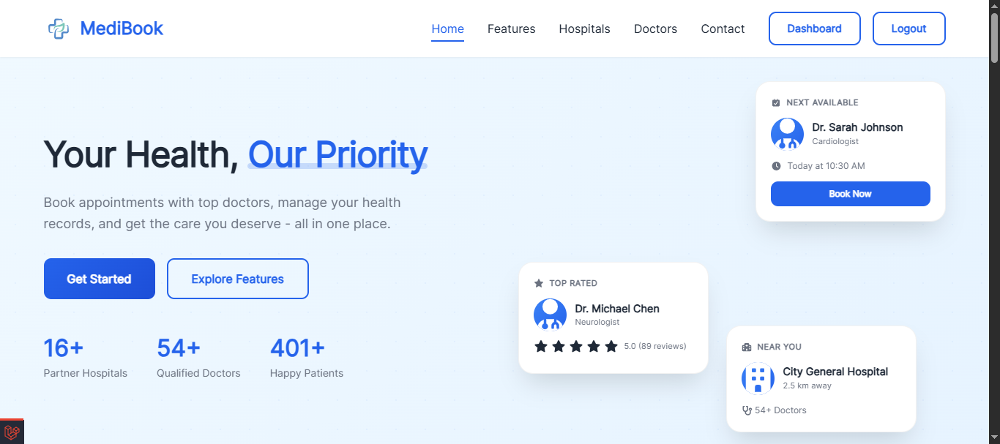
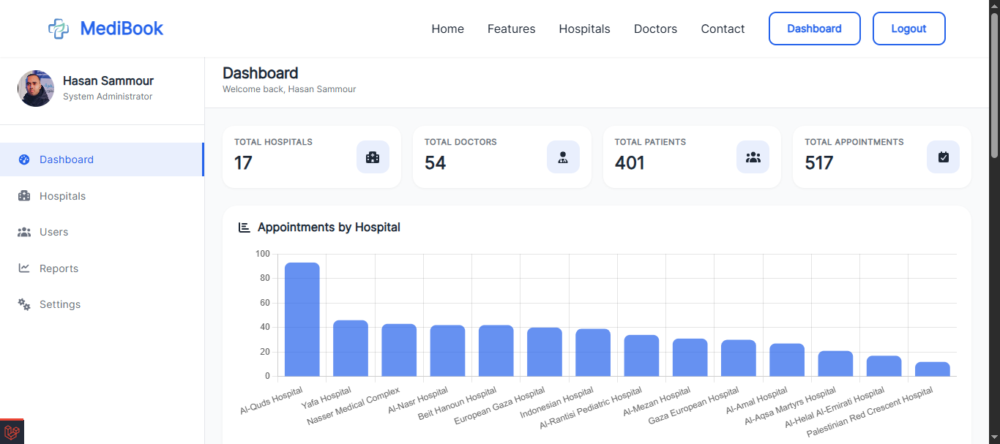
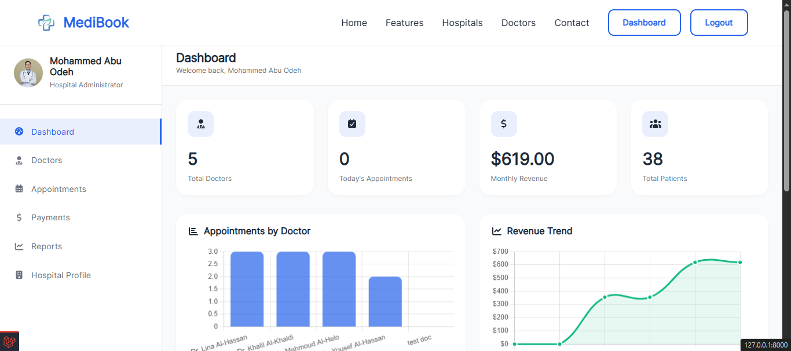
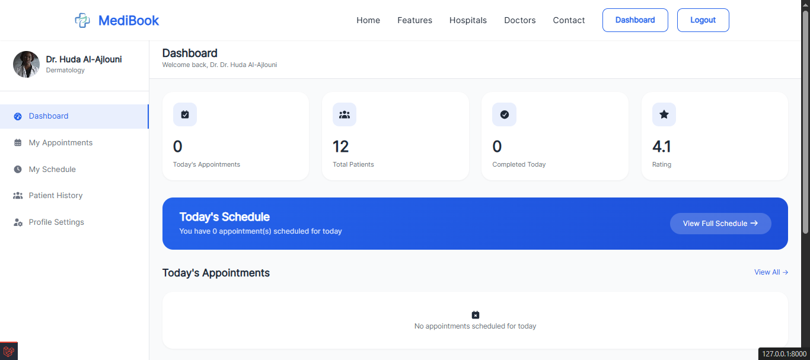
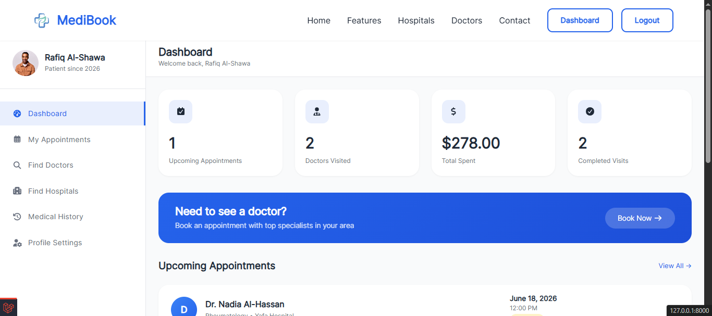

# 🏥 MediBook - Integrated Medical Appointment Management System

[](https://laravel.com)
[](https://php.net)
[](https://mysql.com)
[](https://getbootstrap.com)
[]()

## 📋 Overview

MediBook is a comprehensive web-based platform that streamlines medical appointment management for hospitals, doctors, and patients. Built with **Laravel 12**, **MySQL**, and **Bootstrap**, the system provides role-based dashboards for System Administrators, Hospital Administrators, Doctors, and Patients.

## 🎯 Problem Statement

Hospitals and medical centers face multiple challenges:
- ❌ Duplicate bookings across multiple channels
- ❌ No unified payment tracking system
- ❌ Lack of centralized oversight
- ❌ Patients struggle to find specialized doctors
- ❌ No transparency in appointment history

## ✅ Our Solution

MediBook provides an integrated platform that:
- ✅ Prevents duplicate bookings with conflict detection
- ✅ Tracks payments manually after patient visits
- ✅ Centralizes all hospital management
- ✅ Enables easy doctor search by specialty and location
- ✅ Provides complete appointment history for patients

---

## 👥 User Roles & Features

### 👑 System Administrator
| Feature | Description |
|---------|-------------|
| Hospital Management | Add, edit, delete, activate/deactivate hospitals |
| User Management | Manage all users (hospital admins, doctors, patients) |
| Platform Reports | View analytics and export PDF reports |
| Password Reset | Reset passwords for any user |

### 🏥 Hospital Administrator
| Feature | Description |
|---------|-------------|
| Doctor Management | Add, edit, delete doctors with working hours |
| Appointment Management | View all hospital appointments with filters |
| Payment Recording | Record payments for completed appointments |
| Financial Reports | View revenue analytics and export reports |
| Hospital Profile | Update hospital information and logo |

### 👨‍⚕️ Doctor
| Feature | Description |
|---------|-------------|
| Appointment Schedule | View today's and upcoming appointments |
| Appointment Actions | Confirm, cancel, or complete appointments |
| Medical Notes | Add diagnosis and prescription notes |
| Working Hours | Set weekly schedule with break times |
| Patient History | View complete medical history of patients |

### 👤 Patient
| Feature | Description |
|---------|-------------|
| Self-Registration | Create account and manage profile |
| Doctor Search | Search by specialty, location, or hospital |
| Appointment Booking | Book appointments with available time slots |
| Appointment Management | View, cancel (24h policy), track history |
| Medical Records | View past appointments and doctor notes |
| Payment History | Track all payment records |

---

## 🛠️ Technology Stack

| Layer | Technology |
|-------|------------|
| **Backend** | Laravel 12 (PHP 8.2+) |
| **Database** | MySQL 8.0 |
| **Frontend** | Bootstrap 5, JavaScript (ES6), AJAX |
| **Authentication** | Laravel Breeze |
| **Authorization** | Spatie Laravel Permission |
| **Charts** | Chart.js |
| **Calendar** | FullCalendar.js |
| **PDF Export** | Barryvdh/DomPDF |
| **Email** | SMTP (Gmail) |

---

## 📁 Project Structure

```
MediBook/
├── app/
│   ├── Http/
│   │   └── Controllers/
│   │       ├── Admin/          (5 controllers)
│   │       ├── Auth/           (10 controllers)
│   │       ├── Doctor/         (5 controllers)
│   │       ├── Hospital/       (6 controllers)
│   │       └── Patient/        (7 controllers)
│   └── Models/                 (User, Hospital, Appointment, Payment)
├── database/
│   ├── migrations/             (15+ migration files)
│   └── seeders/                (5 seeders with 500+ records)
├── resources/
│   └── views/
│       ├── admin/              (Admin dashboard & management)
│       ├── hospital/           (Hospital admin pages)
│       ├── doctor/             (Doctor dashboard & schedule)
│       ├── patient/            (Patient dashboard & booking)
│       ├── auth/               (Login, register, password reset)
│       ├── public/             (Home, features, contact)
│       └── emails/             (Email templates)
├── routes/
│   ├── web.php                 (All application routes)
│   └── auth.php                (Authentication routes)
└── public/
    ├── assets/                 (CSS, JS, images)
    └── uploads/                (User uploaded files)
```

---

## 🚀 Installation Guide

### Prerequisites

- PHP >= 8.2
- Composer
- MySQL >= 8.0
- Node.js & NPM
- XAMPP / WAMP / Laragon (for local development)

### Step-by-Step Installation

```bash
# 1. Clone the repository
git clone https://github.com/HasanSammour/MediBook.git
cd MediBook

# 2. Install PHP dependencies
composer install

# 3. Install NPM dependencies
npm install

# 4. Copy environment file
cp .env.example .env

# 5. Generate application key
php artisan key:generate

# 6. Configure database in .env file
DB_CONNECTION=mysql
DB_HOST=127.0.0.1
DB_PORT=3306
DB_DATABASE=medibook
DB_USERNAME=root
DB_PASSWORD=

# 7. Run migrations and seeders
php artisan migrate --seed

# 8. Create storage link
php artisan storage:link

# 9. Compile assets
npm run build

# 10. Start the server
php artisan serve
```

### Default Login Credentials

| Role | Email | Password |
|------|-------|----------|
| System Admin | admin@system.com | password |
| Hospital Admin | from what seeded | password |
| Doctor | from what seeded | password |
| Patient | from what seeded | password |

---

## 📊 Database Schema

### Tables Structure

| Table | Description | Records (Seeded) |
|-------|-------------|------------------|
| users | All system users | 500+ |
| hospitals | Hospital information | 15 |
| appointments | Appointment records | 550 |
| payments | Payment records | 440 |
| roles | User roles (4) | 4 |
| permissions | System permissions | 40+ |

### Relationships

```
users ──┬── belongsTo ── hospitals
        ├── hasMany ── appointments (as patient)
        └── hasMany ── appointments (as doctor)

hospitals ── hasMany ── users
appointments ── belongsTo ── users (patient/doctor)
appointments ── hasOne ── payments
```

---

## 🔐 Security Features

| Feature | Implementation |
|---------|----------------|
| SQL Injection | Eloquent ORM (prepared statements) |
| XSS Protection | Automatic output escaping |
| CSRF Protection | Tokens on all forms |
| Password Hashing | bcrypt (12 rounds) |
| Session Security | Encrypted, HTTP-only cookies |
| Role-Based Access | Spatie Permission (4 roles, 40+ permissions) |
| Rate Limiting | Throttle middleware on sensitive endpoints |
| File Validation | Type + size validation (max 2MB) |

---

## 🧪 Testing Edge Cases Handled

| Edge Case | Handling |
|-----------|----------|
| Text in numeric fields | Server-side validation |
| Unauthorized access | 403 Forbidden + redirect |
| Past date booking | Client + server validation |
| Concurrent booking | Conflict detection |
| Large file upload | 2MB limit + error message |
| Empty search results | Friendly empty state |
| Session expiry | Redirect to login |
| Double form submission | Button disabled after click |

---

## 📸 Screenshots

### Homepage


### System Admin Dashboard


### Hospital Admin Dashboard


### Doctor Dashboard


### Patient Booking


---

## 📚 Course Information

| Field | Detail |
|-------|--------|
| **Course** | ECOM (5416): Parallel and Distributed Systems |
| **Title** | Programming for the World Wide Web |
| **Supervisors** | Eng. Nour R. Saad & Dr. Hatem M. Hammad |
| **Institution** | Islamic University of Gaza |
| **Semester** | 2025/2026 |

---

## 📄 License

This project is an academic project for educational purposes.

---

## 🙏 Acknowledgments

- Laravel Community for the excellent framework
- Spatie for the permission package
- Bootstrap for the frontend components
- All team members for their dedication

---

## 📧 Contact

For any inquiries, please contact:
- **Email:** hasansammour01@gmail.com
- **GitHub:** [HasanSammour](https://github.com/HasanSammour)

---

**© 2026 MediBook - All Rights Reserved**